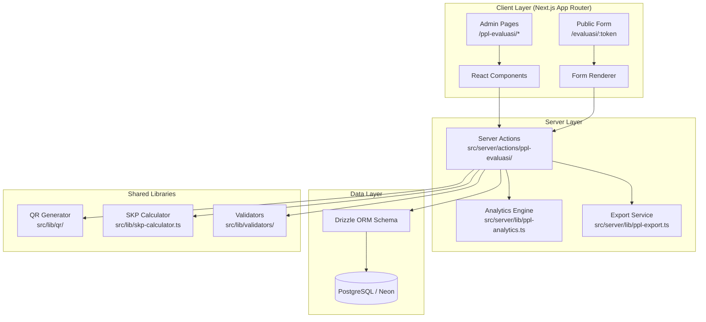
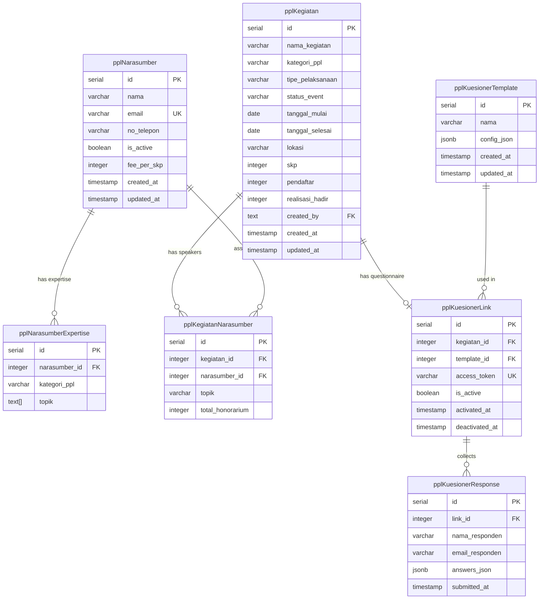

# Design Document: Workshop Evaluation Analytics

## Overview

Modul Workshop Evaluation Analytics menyediakan sistem end-to-end untuk mengelola kegiatan PPL (Pendidikan Profesional Lanjutan) IAI Jakarta, termasuk manajemen narasumber, pembuatan kuesioner evaluasi fleksibel, pengumpulan respons peserta, tracking registrasi & kehadiran, serta dashboard analytics internal untuk perencanaan program tahunan berbasis data.

Modul ini dibangun sebagai ekstensi dari ekosistem Arka yang sudah ada, menggunakan arsitektur Next.js App Router dengan server actions, Drizzle ORM untuk akses database PostgreSQL (Neon), dan komponen UI berbasis Radix UI + Tailwind CSS.

### Key Design Decisions

1. **Extend existing `events` table** — Kegiatan PPL akan menggunakan tabel baru `pplKegiatan` yang terpisah dari tabel `events` yang sudah ada, karena memiliki field khusus (Kategori_PPL yang lebih granular, tipe pelaksanaan, status arsip) dan relasi yang berbeda (narasumber, kuesioner, attendance tracking).

2. **JSON-based form builder** — Konfigurasi kuesioner disimpan sebagai `jsonb` column (`configJson`) untuk fleksibilitas field types tanpa perlu migrasi schema setiap ada tipe field baru.

3. **Answers stored as JSONB** — Jawaban peserta disimpan sebagai satu dokumen JSON per respons, memungkinkan query analytics yang efisien menggunakan PostgreSQL JSONB operators.

4. **Server-side analytics computation** — Semua kalkulasi statistik (rata-rata, median, standar deviasi, distribusi frekuensi) dilakukan di server action layer, bukan di client, untuk konsistensi dan performa.

5. **Public response URL** — Endpoint pengisian kuesioner bersifat publik (tanpa auth) menggunakan unique token, sementara semua halaman admin tetap memerlukan autentikasi.

## Architecture



### Route Structure

```
src/app/(dashboard)/ppl-evaluasi/
├── page.tsx                          # List kegiatan PPL
├── [id]/
│   ├── page.tsx                      # Detail kegiatan
│   ├── kuesioner/
│   │   └── page.tsx                  # Form builder
│   ├── responses/
│   │   └── page.tsx                  # List responses + analytics per field
│   └── attendance/
│       └── page.tsx                  # Registrasi & kehadiran
├── narasumber/
│   └── page.tsx                      # CRUD narasumber
├── analytics/
│   ├── page.tsx                      # Dashboard kehadiran & kategori
│   ├── perencanaan/
│   │   └── page.tsx                  # Analisis pola & rekomendasi
│   └── narasumber/
│       └── page.tsx                  # Performa narasumber

src/app/evaluasi/
└── [token]/
    └── page.tsx                      # Public form (no auth)
```

## Components and Interfaces

### Server Actions Interface

```typescript
// src/server/actions/ppl-evaluasi/kegiatan.ts
export async function createKegiatan(data: CreateKegiatanInput): Promise<ActionResult<{ id: number }>>
export async function updateKegiatan(id: number, data: UpdateKegiatanInput): Promise<ActionResult>
export async function deleteKegiatan(id: number): Promise<ActionResult>
export async function listKegiatan(opts: ListKegiatanOpts): Promise<PaginatedResult<KegiatanRow>>
export async function getKegiatan(id: number): Promise<KegiatanDetail | null>

// src/server/actions/ppl-evaluasi/narasumber.ts
export async function createNarasumber(data: CreateNarasumberInput): Promise<ActionResult<{ id: number }>>
export async function updateNarasumber(id: number, data: UpdateNarasumberInput): Promise<ActionResult>
export async function deactivateNarasumber(id: number): Promise<ActionResult>
export async function listNarasumber(opts: ListNarasumberOpts): Promise<PaginatedResult<NarasumberRow>>
export async function assignNarasumberToKegiatan(data: AssignNarasumberInput): Promise<ActionResult>

// src/server/actions/ppl-evaluasi/kuesioner.ts
export async function createTemplate(data: CreateTemplateInput): Promise<ActionResult<{ id: number }>>
export async function updateTemplate(id: number, data: UpdateTemplateInput): Promise<ActionResult>
export async function duplicateTemplate(id: number, newName: string): Promise<ActionResult<{ id: number }>>
export async function linkTemplateToKegiatan(templateId: number, kegiatanId: number): Promise<ActionResult>
export async function activateKuesioner(kegiatanId: number): Promise<ActionResult<{ url: string; qrDataUrl: string }>>
export async function deactivateKuesioner(kegiatanId: number): Promise<ActionResult>

// src/server/actions/ppl-evaluasi/responses.ts
export async function submitResponse(token: string, data: SubmitResponseInput): Promise<ActionResult>
export async function getKuesionerByToken(token: string): Promise<PublicKuesionerData | null>
export async function listResponses(kegiatanId: number, opts: PaginationOpts): Promise<PaginatedResult<ResponseRow>>

// src/server/actions/ppl-evaluasi/attendance.ts
export async function updateAttendance(kegiatanId: number, data: AttendanceInput): Promise<ActionResult>

// src/server/actions/ppl-evaluasi/analytics.ts
export async function getFieldAnalytics(kegiatanId: number): Promise<FieldAnalyticsResult[]>
export async function getAttendanceDashboard(filter: DashboardFilter): Promise<AttendanceDashboardData>
export async function getPatternAnalysis(filter: DashboardFilter): Promise<PatternAnalysisData>
export async function getSpeakerPerformance(filter: SpeakerFilter): Promise<SpeakerPerformanceData>

// src/server/actions/ppl-evaluasi/export.ts
export async function exportResponsesCsv(kegiatanId: number): Promise<ActionResult<{ blob: Blob }>>
export async function exportResponsesXlsx(kegiatanId: number): Promise<ActionResult<{ blob: Blob }>>
export async function exportProgramTahunan(filter: DashboardFilter, format: "pdf" | "xlsx"): Promise<ActionResult<{ blob: Blob }>>
```

### Form Builder Component Interface

```typescript
// src/components/ppl-evaluasi/form-builder/types.ts
export type FieldType = "text" | "textarea" | "number" | "email" | "select" | "radio" | "checkbox" | "scale" | "grid";

export interface FormField {
  id: string;           // nanoid
  type: FieldType;
  label: string;        // max 300 chars
  required: boolean;
  order: number;
  config: ScaleConfig | GridConfig | OptionsConfig | null;
}

export interface ScaleConfig {
  min: number;          // 1-10
  max: number;          // 1-10, must be > min
  minLabel: string;     // max 50 chars
  maxLabel: string;     // max 50 chars
}

export interface GridConfig {
  rows: string[];       // 1-30 items, max 300 chars each
  columns: string[];    // 2-10 items, max 100 chars each
}

export interface OptionsConfig {
  options: string[];    // 1-50 items, max 200 chars each
}

export interface KuesionerTemplate {
  id: number;
  nama: string;         // max 200 chars
  fields: FormField[];  // 1-50 fields
  createdAt: Date;
  updatedAt: Date;
}
```

### Analytics Engine Interface

```typescript
// src/server/lib/ppl-analytics.ts
export interface ScaleAnalytics {
  fieldId: string;
  label: string;
  mean: number;           // rounded to 2 decimal places
  median: number;
  stdDev: number;         // rounded to 2 decimal places
  distribution: Record<number, number>;  // value -> count
  totalResponses: number;
}

export interface GridAnalytics {
  fieldId: string;
  label: string;
  rows: Array<{
    rowLabel: string;
    mean: number;         // rounded to 2 decimal places
    distribution: Record<string, number>;  // column -> count
  }>;
  totalResponses: number;
}

export interface ChoiceAnalytics {
  fieldId: string;
  label: string;
  type: "radio" | "select" | "checkbox";
  options: Array<{
    label: string;
    count: number;
    percentage: number;   // rounded to 1 decimal place
  }>;
  totalResponses: number;
}

export interface TextAnalytics {
  fieldId: string;
  label: string;
  responses: string[];
  totalResponses: number;
}

export function computeScaleAnalytics(values: number[]): { mean: number; median: number; stdDev: number; distribution: Record<number, number> }
export function computeGridAnalytics(responses: GridResponse[], config: GridConfig): GridAnalytics
export function computeChoiceAnalytics(responses: string[][], options: string[], isMulti: boolean): ChoiceAnalytics
export function computeConversionRate(pendaftar: number, realisasiHadir: number): number | null
export function computePopularityScore(params: PopularityParams): number
```

## Data Models

### Database Schema (Drizzle ORM)



### Drizzle Schema Definition

```typescript
// New enums
export const kategoriPplEnum = pgEnum("kategori_ppl", [
  "Perpajakan",
  "Sistem Informasi & Softskill",
  "Akuntansi Keuangan",
  "Audit",
  "Akuntansi Syariah",
  "Akuntansi Manajemen",
  "Akuntansi Manajemen dan Manajemen Keuangan",
  "Akuntansi Perpajakan",
  "Manajemen Keuangan",
  "Akuntansi Keuangan & Softskill",
  "Akuntansi Keuangan dan Manajemen Keuangan",
  "Manajemen Strategik",
  "SAK & PSAK",
]);

export const statusPplEnum = pgEnum("status_ppl", [
  "aktif",
  "archived",
]);

// ─── PPL KEGIATAN ────────────────────────────────────────────────────────────

export const pplKegiatan = pgTable("ppl_kegiatan", {
  id: serial("id").primaryKey(),
  namaKegiatan: varchar("nama_kegiatan", { length: 255 }).notNull(),
  kategoriPpl: kategoriPplEnum("kategori_ppl").notNull(),
  tipePelaksanaan: tipePelaksanaanEnum("tipe_pelaksanaan").notNull(),
  statusEvent: statusPplEnum("status_event").default("aktif").notNull(),
  tanggalMulai: date("tanggal_mulai").notNull(),
  tanggalSelesai: date("tanggal_selesai").notNull(),
  lokasi: varchar("lokasi", { length: 255 }),
  skp: integer("skp").notNull(),
  pendaftar: integer("pendaftar").default(0).notNull(),
  realisasiHadir: integer("realisasi_hadir").default(0).notNull(),
  createdBy: text("created_by").references(() => users.id),
  createdAt: timestamp("created_at").defaultNow(),
  updatedAt: timestamp("updated_at").defaultNow(),
});

// ─── PPL NARASUMBER ──────────────────────────────────────────────────────────

export const pplNarasumber = pgTable("ppl_narasumber", {
  id: serial("id").primaryKey(),
  nama: varchar("nama", { length: 200 }).notNull(),
  email: varchar("email", { length: 150 }).unique().notNull(),
  noTelepon: varchar("no_telepon", { length: 30 }),
  isActive: boolean("is_active").default(true).notNull(),
  feePerSkp: integer("fee_per_skp").default(0).notNull(),
  createdAt: timestamp("created_at").defaultNow(),
  updatedAt: timestamp("updated_at").defaultNow(),
});

export const pplNarasumberExpertise = pgTable("ppl_narasumber_expertise", {
  id: serial("id").primaryKey(),
  narasumberId: integer("narasumber_id")
    .notNull()
    .references(() => pplNarasumber.id, { onDelete: "cascade" }),
  kategoriPpl: kategoriPplEnum("kategori_ppl").notNull(),
  topik: jsonb("topik").$type<string[]>().default([]).notNull(),
}, (t) => ({
  narasumberIdx: index("ppl_narasumber_expertise_narasumber_idx").on(t.narasumberId),
  uniqueNarasumberKategori: uniqueIndex("ppl_narasumber_expertise_unique").on(t.narasumberId, t.kategoriPpl),
}));

// ─── PPL KEGIATAN-NARASUMBER ASSIGNMENT ──────────────────────────────────────

export const pplKegiatanNarasumber = pgTable("ppl_kegiatan_narasumber", {
  id: serial("id").primaryKey(),
  kegiatanId: integer("kegiatan_id")
    .notNull()
    .references(() => pplKegiatan.id, { onDelete: "cascade" }),
  narasumberId: integer("narasumber_id")
    .notNull()
    .references(() => pplNarasumber.id, { onDelete: "restrict" }),
  topik: varchar("topik", { length: 200 }),
  totalHonorarium: integer("total_honorarium").default(0).notNull(),
}, (t) => ({
  kegiatanIdx: index("ppl_kegiatan_narasumber_kegiatan_idx").on(t.kegiatanId),
  narasumberIdx: index("ppl_kegiatan_narasumber_narasumber_idx").on(t.narasumberId),
}));

// ─── PPL KUESIONER TEMPLATE ──────────────────────────────────────────────────

export const pplKuesionerTemplate = pgTable("ppl_kuesioner_template", {
  id: serial("id").primaryKey(),
  nama: varchar("nama", { length: 200 }).notNull(),
  configJson: jsonb("config_json").$type<FormField[]>().notNull(),
  createdAt: timestamp("created_at").defaultNow(),
  updatedAt: timestamp("updated_at").defaultNow(),
});

// ─── PPL KUESIONER LINK (kegiatan <-> template) ─────────────────────────────

export const pplKuesionerLink = pgTable("ppl_kuesioner_link", {
  id: serial("id").primaryKey(),
  kegiatanId: integer("kegiatan_id")
    .notNull()
    .references(() => pplKegiatan.id, { onDelete: "cascade" }),
  templateId: integer("template_id")
    .notNull()
    .references(() => pplKuesionerTemplate.id, { onDelete: "restrict" }),
  accessToken: varchar("access_token", { length: 64 }).unique().notNull(),
  isActive: boolean("is_active").default(false).notNull(),
  activatedAt: timestamp("activated_at"),
  deactivatedAt: timestamp("deactivated_at"),
}, (t) => ({
  kegiatanIdx: index("ppl_kuesioner_link_kegiatan_idx").on(t.kegiatanId),
  tokenIdx: uniqueIndex("ppl_kuesioner_link_token_idx").on(t.accessToken),
}));

// ─── PPL KUESIONER RESPONSE ─────────────────────────────────────────────────

export const pplKuesionerResponse = pgTable("ppl_kuesioner_response", {
  id: serial("id").primaryKey(),
  linkId: integer("link_id")
    .notNull()
    .references(() => pplKuesionerLink.id, { onDelete: "cascade" }),
  namaResponden: varchar("nama_responden", { length: 200 }).notNull(),
  emailResponden: varchar("email_responden", { length: 150 }).notNull(),
  answersJson: jsonb("answers_json").$type<Record<string, unknown>>().notNull(),
  submittedAt: timestamp("submitted_at").defaultNow().notNull(),
}, (t) => ({
  linkIdx: index("ppl_kuesioner_response_link_idx").on(t.linkId),
  uniqueResponden: uniqueIndex("ppl_kuesioner_response_unique_responden").on(
    t.linkId,
    sql`lower(${t.namaResponden})`,
    sql`lower(${t.emailResponden})`,
  ),
}));
```

### Zod Validation Schemas

```typescript
// src/lib/validators/ppl-evaluasi.ts
import { z } from "zod";

export const createKegiatanSchema = z.object({
  namaKegiatan: z.string().min(1).max(255),
  kategoriPpl: z.enum([/* all kategori values */]),
  tipePelaksanaan: z.enum(["online", "offline", "hybrid"]),
  tanggalMulai: z.string().regex(/^\d{4}-\d{2}-\d{2}$/),
  tanggalSelesai: z.string().regex(/^\d{4}-\d{2}-\d{2}$/),
  lokasi: z.string().max(255).optional(),
  skp: z.number().int().min(1).max(999).optional(), // if not provided, auto-calculated
}).refine(
  (d) => d.tanggalSelesai >= d.tanggalMulai,
  { message: "Tanggal selesai harus sama atau setelah tanggal mulai" }
);

export const scaleConfigSchema = z.object({
  min: z.number().int().min(1).max(10),
  max: z.number().int().min(1).max(10),
  minLabel: z.string().max(50),
  maxLabel: z.string().max(50),
}).refine((d) => d.min < d.max, { message: "Minimum harus kurang dari maximum" });

export const gridConfigSchema = z.object({
  rows: z.array(z.string().min(1).max(300)).min(1).max(30),
  columns: z.array(z.string().min(1).max(100)).min(2).max(10),
});

export const optionsConfigSchema = z.object({
  options: z.array(z.string().min(1).max(200)).min(1).max(50),
});

export const formFieldSchema = z.object({
  id: z.string(),
  type: z.enum(["text", "textarea", "number", "email", "select", "radio", "checkbox", "scale", "grid"]),
  label: z.string().min(1).max(300),
  required: z.boolean(),
  order: z.number().int().min(0),
  config: z.union([scaleConfigSchema, gridConfigSchema, optionsConfigSchema]).nullable(),
});

export const templateSchema = z.object({
  nama: z.string().min(1).max(200),
  fields: z.array(formFieldSchema).min(1).max(50),
});

export const submitResponseSchema = z.object({
  namaResponden: z.string().min(1).max(200),
  emailResponden: z.string().email().max(150),
  answers: z.record(z.unknown()),
});

export const narasumberSchema = z.object({
  nama: z.string().min(1).max(200),
  email: z.string().email().max(150),
  noTelepon: z.string().max(30).regex(/^[0-9+\-]*$/).optional(),
  feePerSkp: z.number().int().min(0).max(99_999_999),
  isActive: z.boolean().optional(),
});

export const attendanceSchema = z.object({
  pendaftar: z.number().int().min(0).max(99_999),
  realisasiHadir: z.number().int().min(0).max(99_999),
});
```


## Correctness Properties

*A property is a characteristic or behavior that should hold true across all valid executions of a system — essentially, a formal statement about what the system should do. Properties serve as the bridge between human-readable specifications and machine-verifiable correctness guarantees.*

### Property 1: SKP Auto-Calculation

*For any* valid date pair where tanggalSelesai >= tanggalMulai, the auto-calculated SKP SHALL equal (differenceInCalendarDays(tanggalSelesai, tanggalMulai) + 1) × 8. If a manual SKP value between 1 and 999 is provided, the stored SKP SHALL equal the manual value.

**Validates: Requirements 1.4**

### Property 2: Date Validation Rejects Invalid Ranges

*For any* date pair where tanggalSelesai < tanggalMulai, the validation SHALL reject the input. *For any* date pair where tanggalSelesai >= tanggalMulai, the validation SHALL accept the input.

**Validates: Requirements 1.7**

### Property 3: Honorarium Calculation

*For any* Narasumber with fee_per_skp F assigned to a Kegiatan with SKP value S, the total Honorarium SHALL equal F × S.

**Validates: Requirements 2.5**

### Property 4: Form Field Configuration Validation

*For any* scale configuration, the validator SHALL accept it if and only if min and max are integers between 1 and 10 with min < max and labels are ≤ 50 characters. *For any* grid configuration, the validator SHALL accept it if and only if rows count is 1-30 (each ≤ 300 chars) and columns count is 2-10 (each ≤ 100 chars). *For any* options configuration (select/radio/checkbox), the validator SHALL accept it if and only if options count is 1-50 with each option ≤ 200 characters.

**Validates: Requirements 3.3, 3.4, 3.5, 3.10**

### Property 5: Template Field Count Constraint

*For any* questionnaire template, the validator SHALL accept it if and only if it contains between 1 and 50 fields, each with a non-empty label of at most 300 characters and a valid field type.

**Validates: Requirements 3.1, 3.2**

### Property 6: Response Answers Round-Trip

*For any* valid set of answers submitted to a Kuesioner, retrieving the stored response SHALL produce an answers object equivalent to the original submission.

**Validates: Requirements 4.3**

### Property 7: Required Field Validation

*For any* submission where a required field contains only whitespace characters (including empty string), the validation SHALL reject the submission. *For any* submission where all required fields contain at least one non-whitespace character, the validation SHALL accept the submission (assuming other constraints are met).

**Validates: Requirements 4.4**

### Property 8: Case-Insensitive Duplicate Detection

*For any* two submissions to the same Kegiatan where the nama and email match case-insensitively, the second submission SHALL be rejected. *For any* two submissions where nama OR email differ (case-insensitively), both SHALL be accepted.

**Validates: Requirements 4.5, 4.6**

### Property 9: Conversion Rate Calculation

*For any* Kegiatan with pendaftar > 0 and realisasiHadir ≥ 0, the Conversion_Rate SHALL equal round((realisasiHadir / pendaftar) × 100, 1). *For any* Kegiatan with pendaftar = 0, the Conversion_Rate SHALL be null (displayed as "N/A").

**Validates: Requirements 5.3, 5.4**

### Property 10: Scale Field Statistical Analytics

*For any* non-empty array of integer values within a scale range, the computed analytics SHALL satisfy: (a) mean equals the arithmetic average rounded to 2 decimal places, (b) median equals the middle value (or average of two middle values) of the sorted array, (c) standard deviation equals the population standard deviation rounded to 2 decimal places, (d) distribution maps each unique value to its occurrence count, and (e) sum of all distribution counts equals the array length.

**Validates: Requirements 6.1**

### Property 11: Grid Field Per-Row Analytics

*For any* set of grid responses with R rows and C columns, the computed analytics SHALL produce R row results where each row's mean equals the arithmetic average of that row's numeric values rounded to 2 decimal places, and each row's distribution maps each column label to its selection count.

**Validates: Requirements 6.2**

### Property 12: Choice Field Frequency Distribution

*For any* set of responses to a radio/select field, the frequency distribution SHALL map each option to its count, and all percentages SHALL sum to 100% (within rounding tolerance). *For any* set of responses to a checkbox field, each option's percentage SHALL equal (option_count / total_respondents) × 100 rounded to 1 decimal place.

**Validates: Requirements 6.3, 6.4**

### Property 13: Response Rate Calculation

*For any* Kegiatan with realisasiHadir > 0 and responden count R, the response rate SHALL equal round((R / realisasiHadir) × 100, 1). *For any* Kegiatan with realisasiHadir = 0, the response rate SHALL be null.

**Validates: Requirements 6.6, 6.7**

### Property 14: Grid Field Export Column Expansion

*For any* grid field with label L and row labels [R1, R2, ..., Rn], the export SHALL produce n columns named ["{L} - {R1}", "{L} - {R2}", ..., "{L} - {Rn}"], each containing the selected scale value for that row.

**Validates: Requirements 7.4**

### Property 15: Export Row Count Matches Respondent Count

*For any* Kegiatan with N responses, the exported data (excluding header) SHALL contain exactly N rows, one per respondent.

**Validates: Requirements 7.3**

### Property 16: Category-Month Aggregation

*For any* set of Kegiatan within a date range, the aggregation SHALL correctly count the number of Kegiatan per Kategori_PPL per month, and the attendance trend SHALL correctly sum realisasiHadir per Kategori_PPL per month.

**Validates: Requirements 8.1, 8.3**

### Property 17: Date Range Filter Correctness

*For any* set of Kegiatan and a date range filter [start, end], the filtered result SHALL include only Kegiatan where tanggalMulai falls within [start, end], and SHALL exclude all Kegiatan outside this range.

**Validates: Requirements 8.4**

### Property 18: Category Ranking by Total Attendance

*For any* set of Kegiatan grouped by Kategori_PPL, the ranking SHALL be sorted in descending order by total realisasiHadir, such that for any adjacent pair in the ranking, the higher-ranked category has total attendance ≥ the lower-ranked category.

**Validates: Requirements 8.6**

### Property 19: Year-over-Year Percentage Change

*For any* Kategori_PPL with data in two consecutive years (Y and Y-1), the YoY percentage change SHALL equal ((total_Y - total_Y_minus_1) / total_Y_minus_1) × 100. The trend label SHALL be "pertumbuhan" if change > 0 and "penurunan" if change < 0.

**Validates: Requirements 8.7, 9.3**

### Property 20: Top Months Identification

*For any* Kategori_PPL with ≥ 12 months of historical data, the top 3 months SHALL be the 3 months with the highest average realisasiHadir, sorted descending. No month outside the top 3 SHALL have a higher average than any month in the top 3.

**Validates: Requirements 9.1**

### Property 21: Recommended Months Above Median

*For any* Kategori_PPL, the recommended months SHALL be exactly those months where the average realisasiHadir exceeds the median of all monthly averages for that category.

**Validates: Requirements 9.2**

### Property 22: Popularity Score Bounds and Formula

*For any* set of Kategori_PPL metrics, the popularity score SHALL be in the range [0, 100] and SHALL equal (normalized_attendance × 0.4) + (normalized_conversion × 0.3) + (normalized_eval_score × 0.3) × 100, where normalization uses min-max scaling across all categories. The category with the highest raw metrics SHALL have score 100 (or close to it given the weighted formula).

**Validates: Requirements 9.4**

### Property 23: Narasumber Average Evaluation Score

*For any* Narasumber with linked evaluation responses containing Likert_Scale and Grid_Field numeric values, the average score SHALL equal the arithmetic mean of all such numeric values across all linked Kegiatan responses.

**Validates: Requirements 10.1**

### Property 24: Narasumber Ranking Sorted Descending

*For any* set of Narasumber with evaluation data, the ranking SHALL be sorted in descending order by average evaluation score, such that for any adjacent pair, the higher-ranked narasumber has average score ≥ the lower-ranked narasumber.

**Validates: Requirements 10.2**

### Property 25: Narasumber Kegiatan Count and SKP Sum

*For any* Narasumber, the completed Kegiatan count SHALL equal the number of assigned Kegiatan with status "archived" or past tanggal_selesai, and the total SKP SHALL equal the sum of SKP values from those Kegiatan.

**Validates: Requirements 10.3**

### Property 26: Narasumber Score Trend Chronological Order

*For any* Narasumber with ≥ 2 Kegiatan, the evaluation score trend SHALL be ordered chronologically by tanggal_selesai, such that for any adjacent pair in the trend, the earlier entry has tanggal_selesai ≤ the later entry.

**Validates: Requirements 10.4**

### Property 27: Category Filter Correctness

*For any* Kategori_PPL filter applied to narasumber performance data, the result SHALL include only Kegiatan assignments matching the specified category, and SHALL exclude all assignments with different categories.

**Validates: Requirements 10.5**

## Error Handling

### Validation Errors

| Scenario | Error Response | HTTP Status |
|----------|---------------|-------------|
| Missing required fields in Kegiatan creation | `{ ok: false, error: "Field [nama] wajib diisi" }` | N/A (server action) |
| tanggalSelesai < tanggalMulai | `{ ok: false, error: "Tanggal selesai harus sama atau setelah tanggal mulai" }` | N/A |
| Duplicate narasumber email | `{ ok: false, error: "Email sudah digunakan oleh narasumber lain" }` | N/A |
| Update archived kegiatan | `{ ok: false, error: "Kegiatan yang diarsipkan tidak dapat diubah" }` | N/A |
| Template locked (has responses) | `{ ok: false, error: "Template terkunci karena sudah memiliki respons" }` | N/A |
| Duplicate response submission | `{ ok: false, error: "Respons sudah tercatat untuk peserta ini" }` | N/A |
| Kuesioner deactivated | `{ ok: false, error: "Kuesioner sudah ditutup" }` | N/A |
| Invalid form field config | `{ ok: false, error: "[specific validation failure message]" }` | N/A |
| Export with zero responses | `{ ok: false, error: "Tidak ada data respons untuk diekspor" }` | N/A |

### Runtime Errors

| Scenario | Handling Strategy |
|----------|-------------------|
| Database connection failure | Catch at server action level, return `{ ok: false, error: "Terjadi kesalahan server" }`, log full error |
| QR code generation failure | Catch and return error, allow retry |
| Export timeout (> 30s) | Use streaming/chunked processing for large datasets |
| Invalid JSON in configJson/answersJson | Validate with Zod before storage; on read, handle gracefully with fallback |
| Concurrent duplicate submission | Rely on unique index constraint, catch DB error, return user-friendly message |

### Edge Cases

- **Conversion Rate with 0 pendaftar**: Return `null`, display "N/A"
- **Response Rate with 0 realisasiHadir**: Return `null`, display indicator
- **Popularity score with single category**: All normalized values = 0 (min = max), score = 0. Handle by returning 50 as default when only one category exists.
- **YoY comparison with 0 in previous year**: Display "N/A" for percentage change to avoid division by zero
- **Grid field with all rows having same value**: Standard deviation = 0, which is valid

## Testing Strategy

### Property-Based Testing

This feature is well-suited for property-based testing due to its extensive pure computation logic (statistics, aggregations, validations, formula calculations).

**Library**: [fast-check](https://github.com/dubzzz/fast-check) (already compatible with Vitest)

**Configuration**:
- Minimum 100 iterations per property test
- Each test tagged with: `Feature: workshop-evaluation-analytics, Property {N}: {title}`

**Target modules for PBT**:
1. `src/server/lib/ppl-analytics.ts` — All statistical computations (mean, median, stddev, distribution, aggregation)
2. `src/lib/validators/ppl-evaluasi.ts` — All Zod validation schemas
3. `src/server/lib/ppl-export.ts` — Export data transformation (column expansion, row mapping)
4. `src/server/actions/ppl-evaluasi/` — Business logic (SKP calculation, honorarium, conversion rate, duplicate detection)

### Unit Tests (Example-Based)

- Template duplication creates independent copy
- Archived kegiatan prevents deletion and updates
- Narasumber deactivation instead of deletion when referenced
- QR code generation from access URL
- Default date filter to current year
- Empty state messages for no data scenarios
- CSV export includes UTF-8 BOM
- XLSX summary sheet contains correct statistics

### Integration Tests

- Full CRUD flow for Kegiatan, Narasumber, Templates
- Public form submission flow (token → form → submit → store)
- Export generation for various dataset sizes
- Analytics dashboard data aggregation with real database queries

### Test File Structure

```
src/__tests__/
├── lib/
│   └── ppl-evaluasi/
│       ├── validators.test.ts          # Zod schema validation (PBT)
│       └── validators.unit.test.ts     # Edge case examples
├── server/
│   └── ppl-evaluasi/
│       ├── analytics.property.test.ts  # Statistical computations (PBT)
│       ├── analytics.unit.test.ts      # Specific examples
│       ├── export.property.test.ts     # Export transformations (PBT)
│       ├── kegiatan.test.ts            # Business logic tests
│       ├── narasumber.test.ts          # Business logic tests
│       └── responses.test.ts           # Submission logic tests
```
